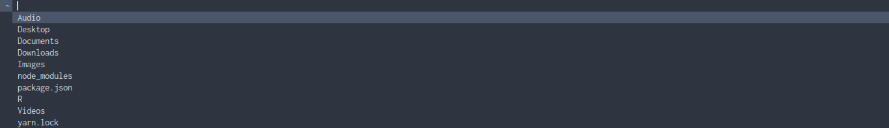

DFM – Dmenu File Manager
================

## Contents

-   [Usage](#usage)
-   [Dependencies](#dependencies)
-   [Installation](#installation)
    -   [Universal](#universal)
    -   [Gentoo](#gentoo)
-   [Uninstallation](#uninstallation)
    -   [Universal](#universal-1)
    -   [Gentoo](#gentoo-1)
-   [Credit](#credit)



DFM is a simple file manager that uses Dmenu. Instead of opening a slow
graphical environment, you open Dmenu and quickly choose whatever file
you want to manipulate. It supports multiple selections and wildcards.
Please submit an issue or a pull request if you do want any changes.

## Usage

``` sh
`# user` dfm --raw # Print the raw output of the selection
`# user` dfm --copy # Copy the raw output of the selection
`# user` dfm --copy-contents # Copy the contents of the selection
`# user` dfm --program # Open the appropriate program for the selection
```

The default is the `program` option.

## Dependencies

1.  dmenu
2.  xdg-utils
3.  gtk+
4.  xclip (if you want to use the *copy* or *copy contents* features.)

Most of these will probably already be installed on your system, with
the exception of Dmenu.

## Installation

### Universal

``` sh
`# user` git clone https://github.com/amarakon/dfm
`# user` cd dfm
`# root` make install
```

### Gentoo

``` sh
`# root` eselect repository add amarlay git https://github.com/amarakon/amarlay
`# root` emerge --sync amarlay
`# root` emerge x11-misc/dfm
```

## Uninstallation

### Universal

``` sh
`# user` cd dfm
`# root` make uninstall
```

### Gentoo

``` sh
`# root` emerge -c x11-misc/dfm
# Remove my overlay (optional)
`# root` eselect-repository remove -f amarlay
`# root` emerge --sync
```

## Credit

This project is based on
[clamiax/scripts](https://github.com/clamiax/scripts). It is based on
the `dbrowse` script.
